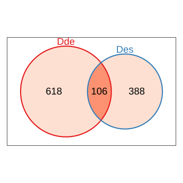
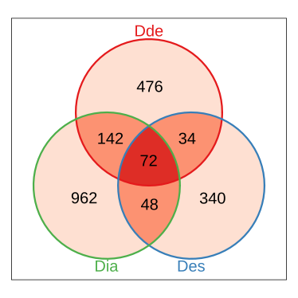
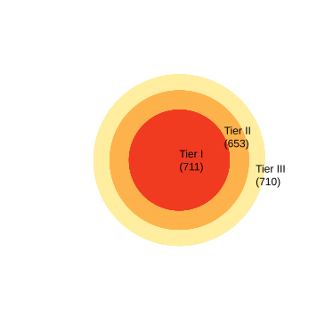
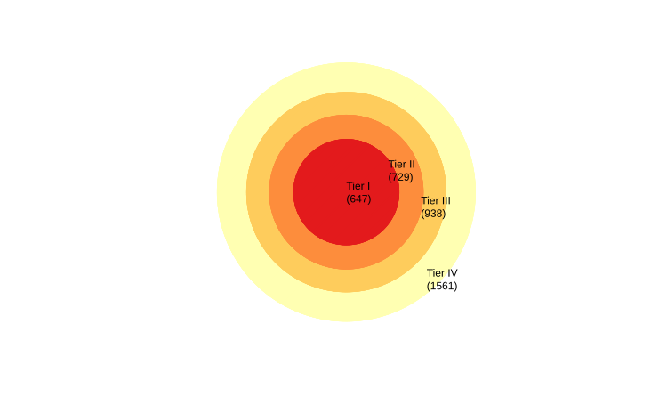
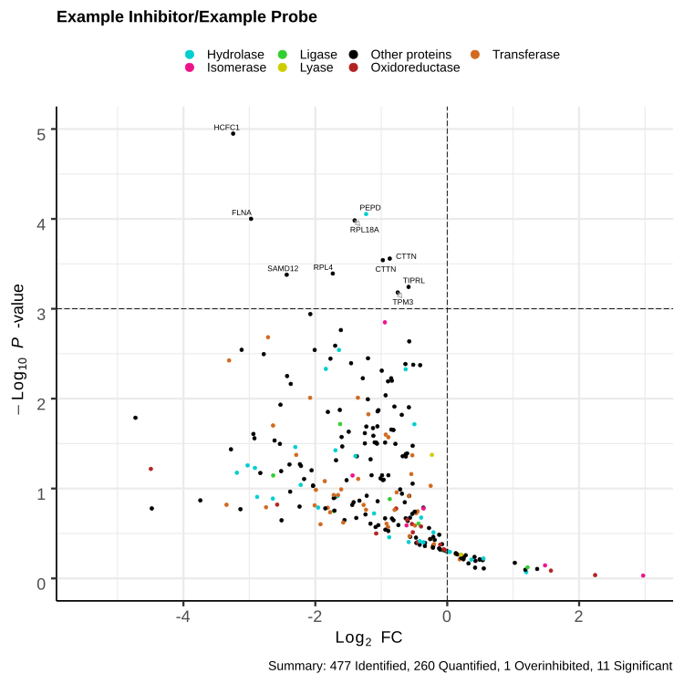

# maxabpp
R package for augmented visualization of MaxQuant identification and label-free quantitation data in peptide-centric competitive activity-based protein profiling or other untargeted proteomics platforms.

Visualizing ABPP Data
---------------------















Getting Started
---------------
  
 How to install this package?
 
1. You need to install the devtools package. You can do this from CRAN. Invoke R and then type
 ```{r}
install.packages("devtools")
 ```
2. Load the devtools package.
 ```{r}
library(devtools)
 ```
3. Install this package directly from github.
 ```{r}
install_github("devradiumking/maxabpp")
 ```  
Usage
-----
     
1. Install dependent R packages.
```{r}
install.packages("tidyverse")
install.packages("stringdist")
install_github('btupper/rscripting')
install.packages("stringr")
install.packages("ggplot2")
install.packages("ggrepel")
```  
2. Load dependent R packages.
```{r}
library(tidyverse)
library(stringdist)
library(rscripting)
library(stringr)
library(ggplot2)
library(ggforce)
library(ggrepel)
library(grid)
library(RColorBrewer)
library(plyr)

```  
3. Call function pairwise_LFQ() on raw MaxQuant output ("modificationSpecificPeptides.txt" and a customized metadata file "metadata.txt" must be put in the folder set as the working directory) to obtain output1, for example:
```{r}
output1 <- pairwise_LFQ(
raw = read.delim("modificationSpecificPeptides.txt", header = TRUE, sep = "\t"), 
metadata = read.delim("metadata.txt", header=TRUE, sep = "\t"), 
name_probe_mod = c("Mod"), 
max_each_mod = 1, 
max_total_mods = 1, 
quantitation_level = "peptide", 
background_check = FALSE)
```
>Note: Multiple modification forms of a single chemical probe can be used as name_probe_mod = c("Mod1", "Mod2"). 
>For instance, original (+ probe mass) and hydrolyzed (+ probe mass + 18 Da). These should be previously set on MaxQuant.

4. Call function append_ec_sites() on output1 to obtain output2, for example:
```{r}
output2 <- append_ec_sites(output1, quantitation_level = "peptide")
```
5. Call function plot_volcano(), on output2 to obtain a volcano plot, for example:
```{r}
plot_volcano(output2, "InhibitorHigh _vs_ InhibitorLow _log2fold_change", "InhibitorHigh _vs_ InhibitorLow _-log10p-value", xlim = c(-8, 3), ylim = c(0, 5), "Gene Names", 1, -1, "InhibitorName/ProbeName")
```
6. New feature of v1.1, you can plot all volcano plots by calling multi_volcano_plots() functions
```{r}
multi_volcano_plots(raw = raw, meta = meta, name_probe_mod = c("Mod"),
                    max_each_mod = 1, max_total_mods = 1, quantitation_level = "peptide" , background_check = FALSE,
                    xlim = c(-10, 3), ylim = c(0, 5), label_col_name = "Gene Names", pCutoff = 0.05, FCcutoff = -2)
```
7. New features of v2.3: visualization of identified proteins groups from MaxQuant proteinGroups.txt with Venn Diagram and Target Diagram of tiered intersection. User-renamed proteinGroups.txt files must be put in the designated folder (default folder name is "proteinGroups"). Create one if needed. Call the functions below to make the plots.
```{r}
setList <- make_proteinGroups_setList(folderName = "proteinGroups")
plot_Max_Venn(Max_Venn(setList, IndividualAnalysis = TRUE))
plot_target(make_tiers(setList))
```
Citation
--------
  
maxabpp was developed at the [Yao Lab](http://web.uconn.edu/yaogroup/index.html) at Chemistry Department, University of Connecticut

If you use this package please cite as:

> Lei Wang and Xudong Yao (2020). maxabpp: R package for augmented visualization of peptide-centric competitive activity-based protein profiling data from MaxQuant protein identification and label-free quantitation output. 
> package version 2.3. https://github.com/devradiumking/maxabpp

